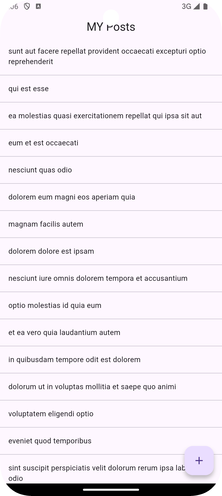
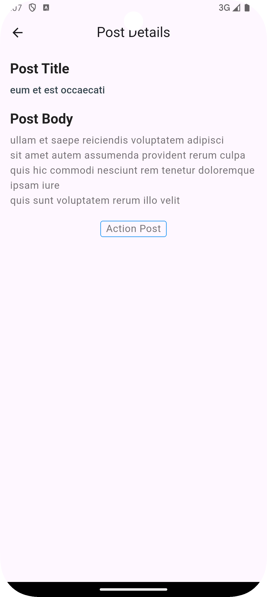
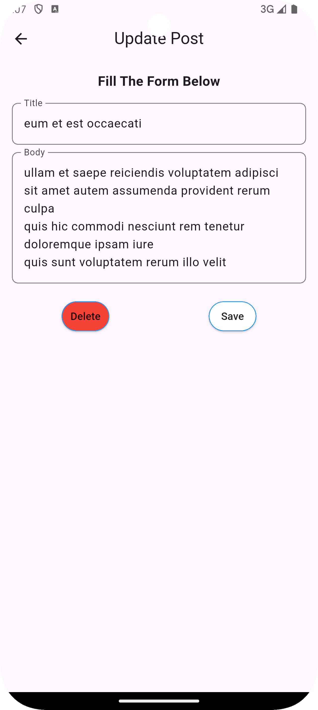

# Fluuter GraphQL Demo

Implementing GraphQL CRUD **BLoC architecture**.

---

# 📱 Features

* View Posts
* View Posts Details
* Update Posts
* State management using BLoC
* Clean and scalable project architecture

---

# 🛠️ Tech Stack

* **Framework:** Flutter
* **Language:** Dart
* **State Management:** BLoC

---

# 🚀 Getting Started

## Prerequisites

Make sure you have the following installed:

* Android Studio
* Flutter SDK

```console
Flutter version: 3.16.9
```

---

## Installation

### 1. Clone the repository

```console
git clone git@github.com:moseskamira/flutter-graphql-demo.git
```

### 2. Navigate to the project

```console
cd flutter-graphql-demo
```

### 3. Install dependencies

```console
flutter pub get
```

---

# ▶️ Running the Application

```console
flutter run
```

---

# ⚙️ Code Generation

Run build runner for generated files:

```console
dart pub run build_runner watch --delete-conflicting-outputs
```

---

# 🍎 Generate iOS Build Config Only

```console
flutter build ios --release --config-only
```

---

# 🧱 Project Architecture

```text
lib/
│
├── data/
│   ├── models/
│   ├── repositories/
│   └── network/
│
├── presentation/
│   ├── bloc/
│   ├── pages/
│   └── widgets/
│
├── shared/
│   └── widgets/
│
├── routes/
│   ├── routes_names/
│   └── routes.dart
│
├── my_app.dart
└── main.dart
```

---

# 📂 Architecture Overview

### Data

Contains:

* Models
* Repositories
* Networks for remote data calls

### Presentation

This contains the following

* UI (pages and widgets)
* State management
* Business logic

### Shared

Reusable widgets and global providers.

## API

- [GraphQL Posts API](https://graphqlzero.almansi.me/api)

---

## Posts:



## Post Details:



## Update/delete Post:



# 👨‍💻 Author

**Kamira Moses**

Flutter & Mobile Applications Developer
